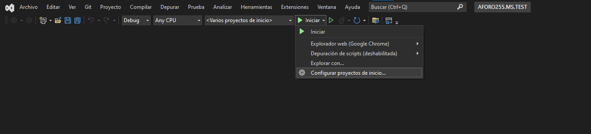
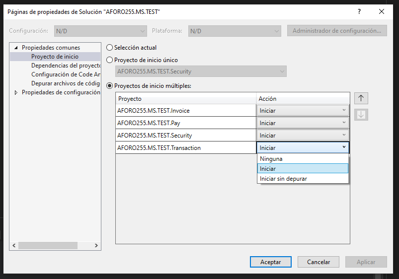
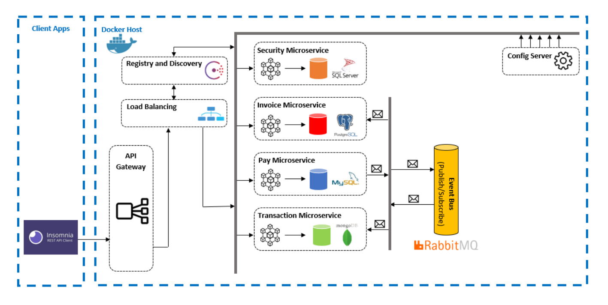

# Proyecto de Integración de Microservicios

## Ejecución de la solución

Debe configurar la inicializacion de todas las soluciones

## Ejercicio de Integración de Microservicios

### Construir una solucion con el nombre AFORO255.MS.TEST y crear dentro de esta los siguientes proyectos:

- AFORO255.MS.TEST.Security: Responsable del token de acceso
- AFORO255.MS.TEST.Invoice: Responsable de listar las facturas de clientes
- AFORO255.MS.TEST.Pay: Responsable de pagar una factura
- AFORO255.MS.TEST.Transaction: Responsable de listar las transacciones de una factura
- AFORO255.MS.TEST.Gateway: Responsable de enmascarar las rutas del proyecto

### Crear las siguientes bases de datos:

- SQL SERVER: Para seguridad.
- POSTGRES: Para las facturas
- MYSQL: Para pagos
- MONGO: Para transacciones

Las bases de datos tendrán estos modelos

#### SQL SERVER

- BD: db_security
- CAMPOS:
  - id_user int primary key
  - username varchar
  - password varchar

#### POSTGRES

- BD: db_invoice
- CAMPOS:
  - id_invoice int primary key
  - amount decimal
  - state int

#### MYSQL

- BD: db_operation
- CAMPOS:
  - id_operation int primary key
  - id_invoice int
  - amount decimal
  - date DateTime

#### MONGO (NO REQUIERE SCRIPT)

- BD: db_transaction
- CAMPOS:
  - id ObjectId
  - id_transaccion int
  - id_invoice int
  - amount decimal
  - date DateTime

### Crear las siguientes componentes:

- Una red de Docker llamada: aforo255-test
- Un servicio de configuración centralizada llamado: config-service-test
- Un servicio de colas llamado: bus-service-test
- Un servicio de registro y descubrimiento llamado: consul-service-test
- Un servicio de balanceo llamado: balancer-service-test
- El microservicio de seguridad dockerizado se llamará: app-security
- El microservicio de invoces dockerizado se llamará: app-invoices
- El microservicio de pagos dockerizado se llamará: app-pay
- El microservicio de transacciones dockerizado se llamará: app-transaction
- El Gateway dockerizado se llamará: app-gateway

Todos los servicios deben correr sobre la red aforo255-test

### Flujo del proyecto

- El microservicio de seguridad debe proporcionar un token de acceso para los microservicios de invoices, pay y transacciones.
- El Gateway debe enmascarar las rutas de los servicios y debe sobrecargar la seguridad, además de enviar la solicitud al balanceador de carga para que este determine a que contenedor enviara la información, según su carga y disponibilidad. Todas las rutas deben trabajarse con el balanceador.
- El microservicio de invoices, debe listar las facturas de clientes y además debe consumir una cola para cambiar el estado de la factura cuando esta se paga a través del microservicio de pago.
- El microservicio de pago debe registrar el pago en su respectiva bd y además debe dejar un mensaje en una cola para actualizar la factura en el microservicio de facturas y además debe dejar un mensaje en una cola para registrar el movimiento en el microservicio de transacciones.
- El microservicio de transacciones debe listar las transacciones de una factura, además debe consumir una cola para obtener las transacciones de pago del microservicio de pago.
- Todos los microservicios deben consumir la cadena de conexión desde el servicio de configuración centralizada.
